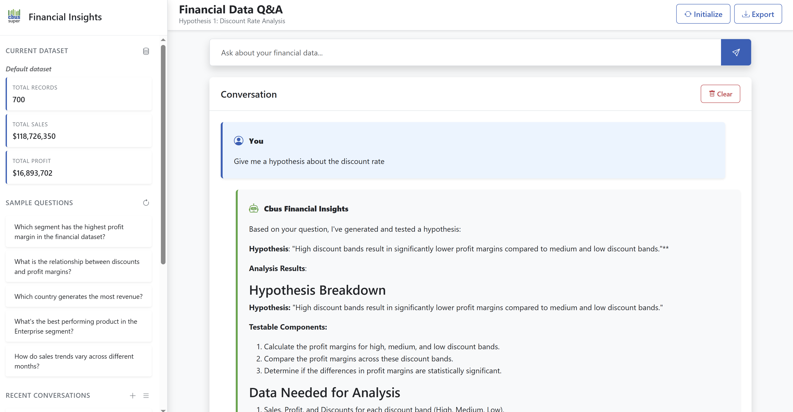

# Multi-Agent Financial Insight Discovery System

A specialised multi-agent system designed to analyze financial datasets and discover valuable business insights. This system leverages Large Language Models (LLMs) with Azure OpenAI integration through the LangChain framework to provide a comprehensive analysis of a financial dataset.



## Overview

This system was designed to analyze financial data through a structured, hypothesis-driven approach. It uses three specialised AI agents that work together to discover, test, and synthesize insights from financial datasets:

1. **Data Analyst Agent** - Performs statistical analysis and tests hypotheses
2. **Hypothesis Generator Agent** - Creates specific, testable hypotheses about the data
3. **Insight Generator Agent** - Synthesizes findings into actionable business insights

## Key Features

- **Specialised Agent Roles**: Each agent focuses on a specific aspect of the analysis process
- **Hypothesis-Driven Analysis**: Structured approach to insight discovery with explicit testing
- **Azure OpenAI Integration**: Secure, enterprise-grade AI capabilities
- **Comprehensive Logging**: Full traceability of the analysis process
- **Flexible Interaction**: Use as a Q&A system or batch process
- **Web Interface**: Optional browser-based interface for interactive exploration

## Sample Insights

The system discovered several valuable insights from the financial dataset, including:

- Enterprise segment's negative profitability is primarily driven by discount strategy
- Higher discount bands consistently result in significantly lower profit margins

For detailed insights and analysis, see the [Key Insights](docs/key_insights.md) document.

## Getting Started

### Prerequisites

- Python 3.8+
- Azure OpenAI API access
> **Note:** If Azure credentials aren't set up, you can look at Recent Conversations to see performance

### Quick Start

1. Clone this repository
2. Install dependencies: `pip install -r requirements.txt`
3. Set up your Azure OpenAI credentials in a `.env` file
4. Run the system: `python app.py`
5. Navigate to `http://localhost:5000` or `http://127.0.0.1:5000/`
6. Use the Q&A interface to ask questions about the data

For detailed setup instructions, see the [Setup Instructions](docs/setup.md) document.

> **Note:** If Azure credentials aren't set up, you can look at Recent Conversations to see performance


## Architecture

The system follows a modular architecture with the following components:

```
┌──────────────────┐     ┌─────────────────────┐     ┌──────────────────┐
│                  │     │                     │     │                  │
│  Data Analysis   │───▶│ Hypothesis Creation │────▶│ Hypothesis Tests │
│  (Analyst Agent) │     │ (Hypothesis Agent)  │     │ (Analyst Agent)  │
│                  │     │                     │     │                  │
└──────────────────┘     └─────────────────────┘     └──────────────────┘
                                                              │
                                                              ▼
                                                    ┌──────────────────┐
                                                    │                  │
                                                    │ Insight Creation │
                                                    │ (Insight Agent)  │
                                                    │                  │
                                                    └──────────────────┘
```

For a detailed explanation of the architecture and approach, see the [Submission Document](docs/submission.md).


## Project Structure

```
financial-insight-system/
├── cache/                        # Cached responses
├── conversations/                # Previous conversations
├── data/
│   └── Financial Sample.xlsx     # Your dataset
├── output/                       # Output directory
├── src/
│   ├── agents/
│   │   ├── agents.py             # Base agent implementations
│   │   └── prompts.py            # Prompts for other agents
│   ├── cache/
│   │   └── manager.py            # Cached message storer
│   ├── conversation/
│   │   └── manager.py            # Conversations manager
│   ├── data/
│   │   └── loader.py             # Data loader
│   ├── dataset/
│   │   └── manager.py            # Extracts the key findings from the dataset
│   ├── orchestration/
│   │   └── controller.py         # Orchestration logic
│   └── visualisations/
│       └── visualisation.py      # Generates visualisations
├── .env                          # Environment variables
├── .gitignore
├── main.py                       # Main entry point
└── requirements.txt              # Dependencies
```

## Limitations and Future Work

Current limitations include:
- Limited validation of numerical calculations
- No automated fact-checking against raw data
- Basic visualization capabilities
- Limited interactivity in the analysis workflow

Future improvements planned:
- Enhanced data validation mechanisms
- Interactive follow-up capabilities
- Advanced visualization features
- Retrieval-augmented generation for more accurate analysis

## License

[MIT License](LICENSE)